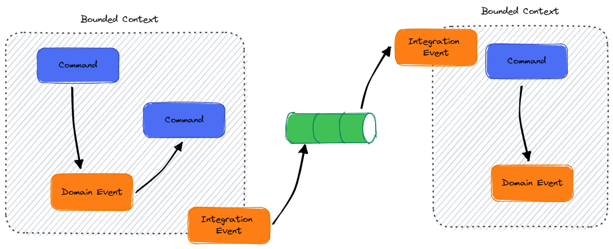

# Domain Events vs Integration Events

Lorem ipsum dolor sit amet, consectetur adipiscing elit. Nam id dolor lacinia, molestie arcu id, cursus augue. Maecenas gravida ante arcu, sed gravida massa consequat eu. Cras interdum nunc scelerisque, accumsan quam sed, convallis mauris. Donec a mi pretium, sodales nunc non, aliquam sapien. Quisque pulvinar vestibulum dolor quis vestibulum. Nunc varius mauris eu metus condimentum pretium. Phasellus sagittis interdum ante, in viverra neque finibus in. Curabitur dolor eros, vulputate ut felis in, pretium porttitor ex. Morbi imperdiet ante sit amet venenatis interdum. Nunc ante orci, convallis at iaculis eu, dignissim a purus. Integer fermentum rhoncus urna, in efficitur nisi eleifend quis. Donec in accumsan nulla. Curabitur condimentum nisi at leo aliquet, quis auctor lectus porttitor. Proin facilisis maximus ipsum, ac varius elit posuere eu. Maecenas fringilla dui eget vehicula tincidunt. Cras posuere, sem et luctus finibus, nulla dui tristique tellus, quis placerat urna odio non nisi.

## Domain Events
Domain events are events that are raised and handled within a bounded context.

## Integration Events
On the other hand, Integration Events are events which are published in one bounded context and consumed within another.
