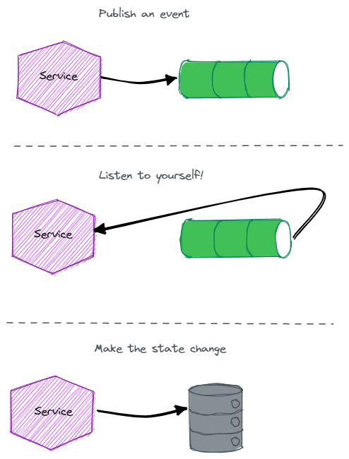

# Listen to Yourself!
 
 ## Problem
How do we atomically record our state change in a database and publish an event?

## Solution
The Listen to Yourself pattern allows a service to defer the state change and instead publish an event that represents the state change. The service then consumes its own event and makes the state change as part of the event handler.

If the service fails to publish the event, then no state change will exist.
If the service fails to consume the event, then the service can retry using specific retry policies

## Advantages
- This pattern doesn't require an outgoing table or sweeper job, unlike the outbox pattern.

## Disadvantages
- The service is not guaranteed to read its own writes.
